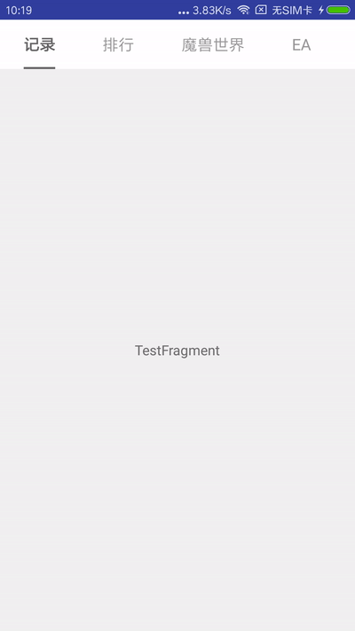
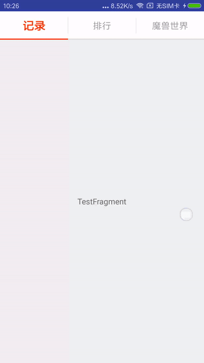

写这个小控件是因为最近负责维护的一款app大改版，设计师给了一个新的ViewPager导航样式，但找了几个常用的导航控件发现都无法100%实现设计师给的效果，于是就干脆自己动手丰衣足食了。

控件只有一个单独的java类，代码也很简单，放出来希望能帮到需要的人。

## 效果

控件提供了比较丰富的可配置选项，下面是两个例子：

1. 所有配置项均使用默认值（tab宽度包裹内容、indicator与文字等宽......）：



2. tab宽度平分父控件剩余空间、indicator与tab等宽......：



## 配置项

在调用setViewPager前，使用一系列setXXX方法进行设置即可，支持链式调用：

```java
indicator.setExpand(true)//设置tab宽度为包裹内容还是平分父控件剩余空间，默认值：false,包裹内容
    .setIndicatorWrapText(false)//设置indicator是与文字等宽还是与整个tab等宽，默认值：true,与文字等宽
    .setIndicatorColor(Color.parseColor("#ff3300"))//indicator颜色
    .setIndicatorHeight(2)//indicator高度
    .setShowUnderline(true, Color.parseColor("#dddddd"), 2)//设置是否展示underline，默认不展示
    .setShowDivider(true, Color.parseColor("#dddddd"), 10, 1)//设置是否展示分隔线，默认不展示
    .setTabTextSize(16)//文字大小
    .setTabTextColor(Color.parseColor("#ff999999"))//文字颜色
    .setTabTypeface(null)//字体
    .setTabTypefaceStyle(Typeface.NORMAL)//字体样式：粗体、斜体等
    .setTabBackgroundResId(0)//设置tab的背景
    .setTabPadding(0)//设置tab的左右padding
    .setSelectedTabTextSize(20)//被选中的文字大小
    .setSelectedTabTextColor(Color.parseColor("#ff3300"))//被选中的文字颜色
    .setSelectedTabTypeface(null)
    .setSelectedTabTypefaceStyle(Typeface.BOLD)
    .setScrollOffset(120);//滚动偏移量

indicator.setViewPager(viewPager);
```

所有的配置项均有默认值，也就是说不进行任何设置也是可以的，效果参考上面的第一张图。
